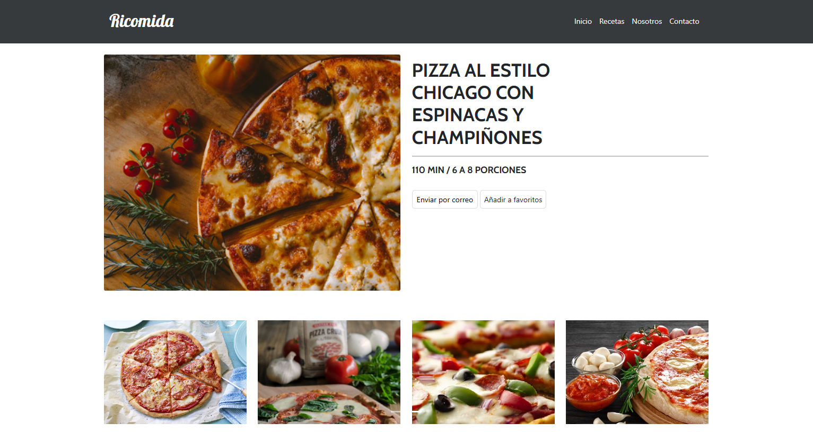
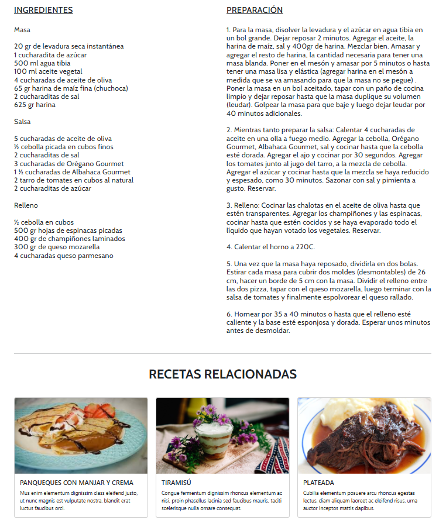

# **BASIC TEMPLATE WITH A RECIPES THEME**

## **Description**
This site is related to meal preparation and recipe showcases. It features a responsive design and interactions triggered by user events.

## **Technologies Used**
HTML5, CSS3, Bootstrap 5, JavaScript, jQuery

## **Features**
- Implements the jQuery library using local and external resources.
- Implements JavaScript components.
- Uses Bootstrap to create a carousel.
- Tooltip element when sending an email.
- Uses tag selectors and jQuery methods.
- Utilizes class selectors.

## **Screenshots**
<p align="center">
  
</p>
<p align="center">
  
</p>
<p align="center">
  
</p>

## **Installation**
1. Clone the repository:
   ```bash
   git clone https://github.com/yadicep/basic_template_recipes.git
